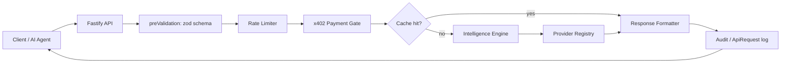
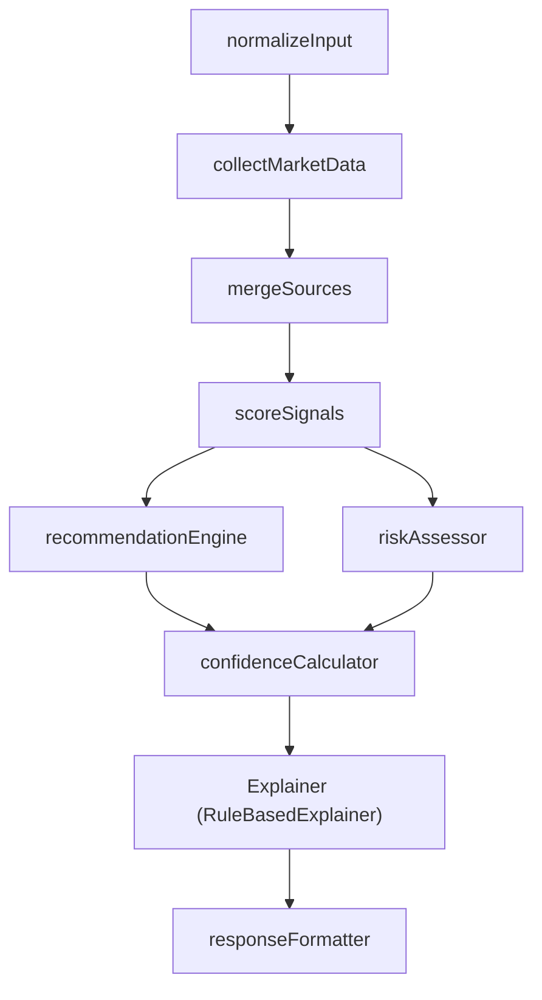
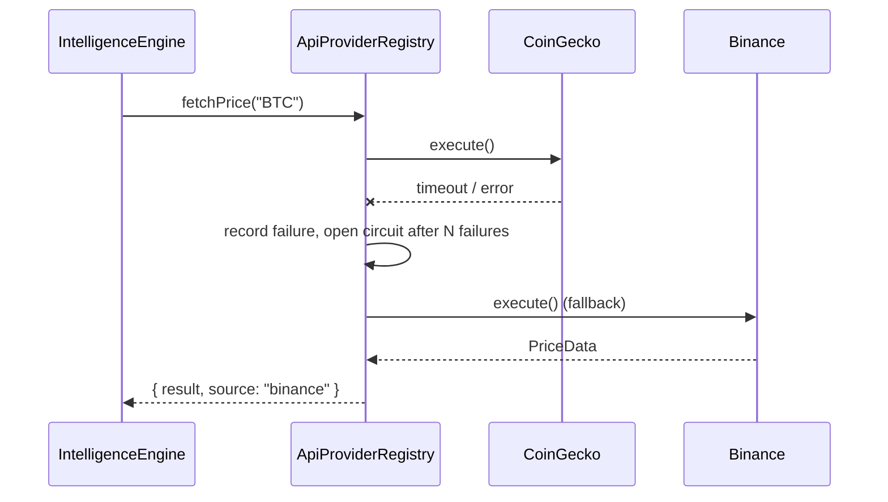
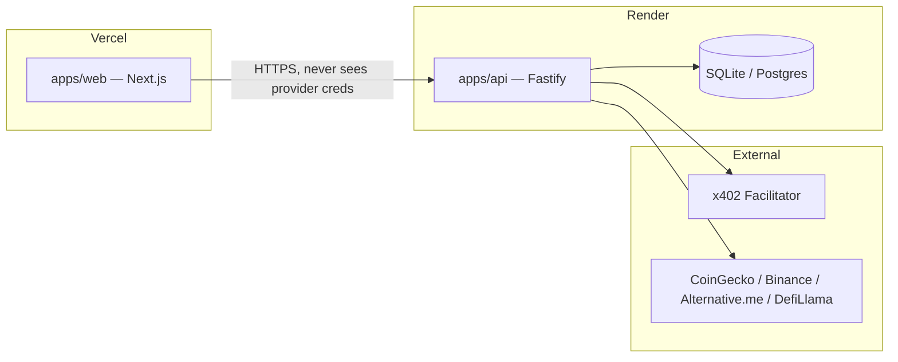

# Architecture

## Request pipeline

Validation runs **before** the payment gate deliberately: an invalid request must fail
for free. If validation ran inside the handler (after payment), a malformed request
would still consume a settled payment before failing.

## Package boundaries

| Package | Responsibility | Depends on |
|---|---|---|
| `shared-types` | zod schemas + inferred types for every API contract | — |
| `secrets` | `SecretManager` — validated, typed, redaction-safe env access | — |
| `config` | Per-app env schema + typed config loader | `secrets` |
| `cache` | `ICache` + `MemoryCache` (default) + `RedisCache` (opt-in, inert until wired) | — |
| `database` | Prisma schema, generated client, one repository class per table | — |
| `providers` | `ApiProviderRegistry` — capability adapters with fallback + circuit breaker | — |
| `payments` | `PaymentProvider` abstraction — x402 protocol logic, provider-agnostic | `shared-types` |
| `intelligence-engine` | The scoring/reasoning pipeline (8 stages) | `providers`, `shared-types` |
| `apps/api` | Fastify HTTP layer: routes, middleware, persistence orchestration | all of the above |
| `apps/web` | Next.js frontend | `shared-types` (contracts only) |

Every package exposes an interface at its boundary (`ProviderAdapter`, `PaymentProvider`,
`ICache`, `Explainer`) so a new implementation can be swapped in via configuration,
never by editing call sites.

## Intelligence engine pipeline

Every stage is a standalone, independently unit-tested pure function or class.
`collectMarketData` is the only stage that talks to the network (via the provider
registry, which already has its own per-capability fallback chain); everything after it
is deterministic and offline-testable.

The `Explainer` interface is the deliberate LLM extension point: `RuleBasedExplainer`
(Phase 1, ships today, zero external dependency) can be swapped for an `LLMExplainer`
later without touching `normalizeInput` through `confidenceCalculator` — same input
shape (`ExplanationInput`), same output shape (`Explanation`).

## Provider fallback chain

If every provider in a capability's chain fails, the registry returns `undefined` —
it never throws. Callers (the intelligence engine's `mergeSources` stage) treat a
missing field as lowered `dataCompleteness`, which flows into both the risk score and
the confidence score. The API never hard-fails a request just because one upstream is
down.

## Payment abstraction

`PaymentProvider` is the only interface routes/middleware talk to. `AlgorandX402Provider`
implements it against a facilitator's documented HTTP contract (`POST /verify`,
`POST /settle`) — the actual x402 interoperability surface — rather than a
facilitator-specific SDK, so any spec-compliant facilitator works unmodified.
`MockPaymentProvider` implements the same interface for local dev/tests. Which one is
active is a single environment variable (`PAYMENT_PROVIDER`), resolved through
`PaymentProviderRegistry` — never a code change. See
[PAYMENT_FLOW.md](PAYMENT_FLOW.md) for the full sequence.

## Deployment shape

