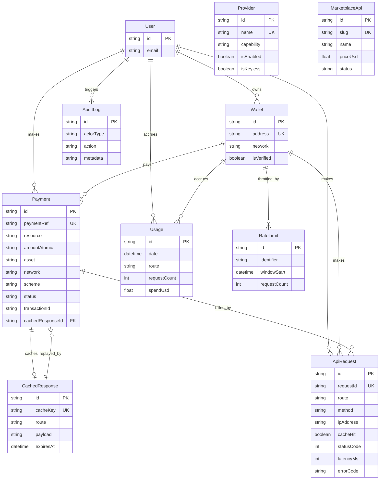

# Database Schema

Prisma + SQLite for Phase 1 (`packages/database/prisma/schema.prisma`), designed to move
to Postgres with a one-line `provider` change — nothing in the schema uses a
SQLite-only feature.

## Notes on key design decisions

- **`Payment.paymentRef` is unique.** This single constraint is what makes duplicate
  payments, replay attacks, and concurrent duplicate requests idempotent — see
  [PAYMENT_FLOW.md](PAYMENT_FLOW.md).
- **`CachedResponse` serves two purposes**: it's the general market-data freshness cache
  key space is shared with `packages/cache`'s in-memory TTL cache conceptually, but the
  DB rows keyed `payment:<ref>` specifically exist for idempotent payment replay —
  durable across process restarts, unlike the in-memory cache.
- **All FKs to `Wallet`/`User` are nullable.** Most Phase 1 traffic is
  anonymous-by-wallet-address or anonymous-by-IP; there's no forced signup.
- **`RateLimit` is the durable/audit counterpart** to the live token-bucket limiter,
  which runs off `packages/cache` for low-latency reads.
- **`AuditLog.metadata` is always redacted** via `@agentmarket/secrets#redactSecrets`
  before being serialized, so a bug elsewhere can't accidentally write a secret into the
  audit trail.
- Every repository (`packages/database/src/repositories/*.ts`) is the *only* place that
  touches Prisma for its table — no raw `prisma.*` calls elsewhere in the codebase.
- **This diagram predates Phase 2's control plane and Phase 7's revenue ledger** —
  `ProviderAccount`, `ApiListing`, and `Payout` aren't pictured above, and `Payment`/
  `ApiRequest` also carry a nullable `listingId` (set only when the call was against a
  published third-party listing; null for first-party traffic). See
  `packages/database/prisma/schema.prisma` for the current, authoritative shape.
