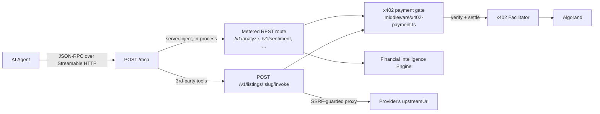
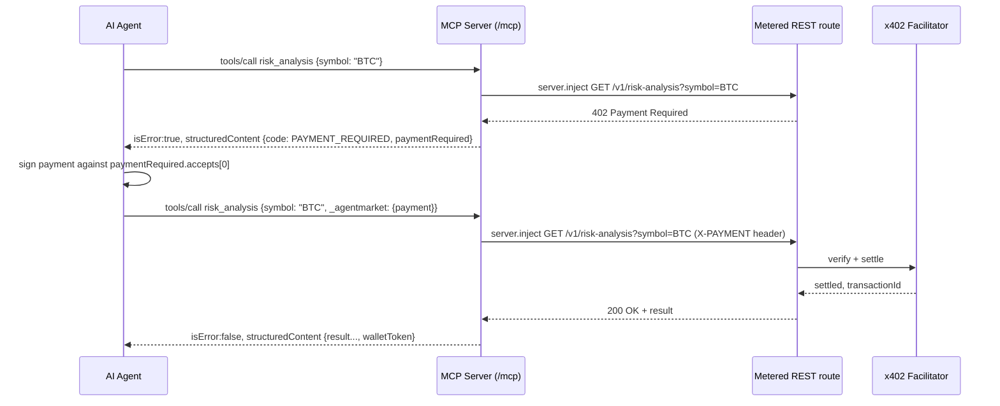

# Model Context Protocol (MCP)

AgentMarket exposes its entire catalog — first-party financial intelligence and every
published third-party listing — as MCP tools, resources, and prompts, so an MCP-compatible
agent (Claude Desktop, Cursor, Windsurf, the MCP Inspector CLI, or any custom client) can
discover, price, pay for, and invoke a capability without ever touching a REST endpoint
directly.

The MCP layer is an **adaptor**, not a second implementation. Every tool call runs through
the same x402 payment gate, rate limiter, response cache, and audit log a direct HTTP
caller gets — see [Architecture](#architecture) below.

## Architecture



`apps/api/src/routes/catalog/mcp.route.ts` registers a real MCP server
(`@modelcontextprotocol/sdk`, Streamable HTTP transport, protocol version
`2025-06-18`) at `POST /mcp`, plus a plain-JSON manifest at
`GET /.well-known/mcp.json` for tooling that would rather `fetch()` the catalog than
speak MCP's JSON-RPC framing.

**Nothing about the payment gate changed to make this possible.** `executeCatalogTool`
(`services/mcp-tool-executor.ts`) calls `server.inject()` — Fastify's in-process request
mechanism, the same one `workflow-executor.ts` already used for its own 402 price probes
— against the tool's real REST route, forwarding whatever `X-PAYMENT` header the agent
supplied. The route's own `preValidation`, x402 `preHandler`, response caching, and audit
logging all run exactly as they would for a real HTTP request, because this *is* one, just
issued without a network hop.

## Local setup

```bash
npm install
npm run dev --workspace=@agentmarket/api   # http://localhost:4000
```

No extra configuration is needed beyond what [docs/INSTALLATION.md](INSTALLATION.md)
already describes — MCP rides on the same Fastify server, same database, same
`PAYMENT_PROVIDER=mock` default. Confirm it's up:

```bash
curl http://localhost:4000/.well-known/mcp.json | jq '.tools | length'
```

### Example MCP client configuration

Claude Desktop / any client reading `mcpServers` config:

```json
{
  "mcpServers": {
    "agentmarket": {
      "url": "http://localhost:4000/mcp",
      "transport": "http"
    }
  }
}
```

Against the deployed API, swap the URL for
`https://agentmarket-api-bedc.onrender.com/mcp`.

## Tool catalog

`tools/list` returns one tool per OpenAPI operation across the first-party catalog and
every published third-party listing, plus one built-in discovery tool. Names are
`<namespace>__<operationId>` (lowercased, non-alphanumerics replaced with `_`).

| Tool | Price | Source |
|---|---|---|
| `discover_capabilities` | Free | Built-in — ranks the catalog against a free-text need (see [Smart discovery](#smart-discovery)) |
| `agentmarket__get_v1_analyze` | $0.05 | First-party |
| `agentmarket__get_v1_market_summary` | $0.02 | First-party |
| `agentmarket__get_v1_sentiment` | $0.02 | First-party |
| `agentmarket__get_v1_risk_analysis` | $0.03 | First-party |
| `agentmarket__get_v1_technical_summary` | $0.03 | First-party |
| `agentmarket__get_v1_trending_assets` | $0.02 | First-party |
| `agentmarket__post_v1_portfolio_health` | $0.04 | First-party |
| `agentmarket__get_v1_execution_readiness` | $0.03 | First-party |
| `<listing-slug>__<operationId>` | Listing's own price | One per published third-party listing operation |

Every tool's `inputSchema` carries the real operation's parameters plus a reserved
`_agentmarket` control object (see below) — nothing is hidden in undocumented protocol
state.

### Smart discovery

`discover_capabilities({ query, maxCostPerCall?, maxLatencyMs? })` reuses the exact TF-IDF
+ trust-score + latency ranking `POST /v1/discover` already serves (`discovery-ranking.ts`)
— relevance to `query` (60 pts), provider trust score (30 pts), a latency penalty when
`maxLatencyMs` is exceeded, and a hard exclusion for anything priced above
`maxCostPerCall`. Use it instead of paging through the full `tools/list` catalog when you
know the job, not the provider:

```json
{ "name": "discover_capabilities", "arguments": { "query": "low-latency crypto sentiment" } }
```

## The `_agentmarket` control block

Every tool argument object accepts an optional `_agentmarket` object — namespaced so it
can never collide with a real parameter a listing happens to declare:

| Field | Type | Meaning |
|---|---|---|
| `payment` | string | Base64 `X-PAYMENT` payload from a prior 402 response, once signed |
| `sessionId` | string | Client-chosen id scoping `maxSessionSpendUsd`/`maxDailySpendUsd` across calls |
| `maxCostUsd` | number | Reject this call with `BUDGET_EXCEEDED` before paying if the tool's price exceeds this |
| `maxSessionSpendUsd` | number | Sets the session's cumulative spend cap (fixed by whichever call first declares it) |
| `maxDailySpendUsd` | number | Sets the session's cumulative UTC-day spend cap |

## Payment sequence



The agent (or its MCP client wrapper) is always the one that signs — see
[packages/agent-sdk](../packages/agent-sdk) for a client that automates this handshake,
or `@x402-avm/avm`'s `ExactAvmScheme` for a real Algorand signer. **AgentMarket never asks
for, stores, or needs a private key.**

## Resources

`resources/list` / `resources/read`, generated from the same read models the storefront
and REST API already use — never a parallel data source:

| URI | Contents |
|---|---|
| `marketplace://catalog` | Every listing (first- and third-party), full marketplace shape |
| `marketplace://pricing` | id/name/price/pricing-model only |
| `marketplace://status` | Live availability status per listing |
| `marketplace://api/{listingId or slug}` | One listing's full detail |
| `marketplace://provider/{providerId}` | Public-safe provider view (name, status, trust score — **not** email, which stays private to the account owner/admin) |

## Prompts

`prompts/list` / `prompts/get` — each one composes existing tools, never new business
logic:

| Prompt | Arguments |
|---|---|
| `analyze_market` | `symbol` |
| `compare_market_signals` | `symbols` (comma-separated) |
| `assess_portfolio_risk` | `holdings` (JSON array of `{symbol, quantity}`) |
| `find_best_market_data_provider` | `need` (free text) |

## Error codes

`mcp-tool-executor.ts` maps this platform's existing `AppError` codes
([shared-types/errors.ts](../packages/shared-types/src/errors.ts)) onto the MCP-facing
vocabulary — one small translation table, not a second taxonomy:

| MCP code | Internal source |
|---|---|
| `PAYMENT_REQUIRED` | No `X-PAYMENT` / no `_agentmarket.payment` yet |
| `PAYMENT_FAILED` | `PAYMENT_INVALID`, `PAYMENT_VERIFICATION_FAILED` |
| `PAYMENT_ALREADY_USED` | `PAYMENT_ALREADY_SETTLED` (replay of a settled `paymentRef`) |
| `PROVIDER_UNAVAILABLE` | Upstream (first- or third-party) unreachable, timed out, or blocked by the SSRF guard |
| `RATE_LIMITED` | Global per-IP/per-wallet rate limit |
| `INVALID_ARGUMENT` | `VALIDATION_ERROR` — bad/missing tool arguments |
| `CAPABILITY_NOT_FOUND` | Unknown tool name, or `NOT_FOUND` from the underlying route |
| `BUDGET_EXCEEDED` | Declared `_agentmarket` cap would be exceeded, or the platform's wallet daily-spend cap |
| `INTERNAL_ERROR` | Anything unmapped |

`PAYMENT_EXPIRED` is in the spec's vocabulary but not currently distinguishable from
`PAYMENT_FAILED` at the payment-provider layer — see
[Known limitations](#known-limitations).

## Budget control

Three levels, two different enforcement points:

- **Per-call** (`maxCostUsd`): checked in-process before any payment is attempted — no
  session needed.
- **Session** (`maxSessionSpendUsd`, `maxDailySpendUsd`): tracked in-memory, keyed by the
  agent's own `_agentmarket.sessionId` — **not** the MCP transport's own session concept,
  which stays stateless (see [Known limitations](#known-limitations)). A session's caps
  are fixed by whichever call first declares them; a later call cannot loosen them.
- **Platform daily cap**: the pre-existing, DB-backed per-wallet daily spend cap in
  `middleware/x402-payment.ts` still applies underneath all of the above, regardless of
  what any agent declares.

## Security model

- **No bypass of x402, rate limiting, or replay protection** — every tool call is a real
  request through the real route (`server.inject`, not a parallel code path).
- **SSRF-safe third-party proxy** (`services/listing-invocation.ts`): a listing's
  `upstreamUrl` is checked against loopback/RFC1918/link-local ranges (including the
  common cloud metadata address `169.254.169.254`) before every call, on top of a
  publish-time format check. Path parameters are placed via `URL`/`encodeURIComponent`,
  never string concatenation, so a value can't smuggle extra path segments.
- **No private keys accepted or stored.** The `payment` field only ever carries an
  already-signed `X-PAYMENT` payload.
- **Provider metadata sanitized**: the `marketplace://provider/*` resource deliberately
  omits the account email `toProviderAccountView` (the authenticated/admin view) includes.
- **Timeouts**: every upstream listing call is bounded (15s, `AbortController`) so one slow
  provider can't pin a Fastify worker.
- **Input validation**: tool arguments are validated by the real route's own Zod schema
  (first-party) or the listing's own OpenAPI-declared required parameters (third-party) —
  before payment is taken, per this codebase's existing "fail free" convention.

## Example agent interaction

> Agent: *"I need a BTC market risk assessment."*

1. `tools/call discover_capabilities {"query": "BTC market risk assessment"}` → ranks
   `risk_analysis` near the top.
2. `tools/call agentmarket__get_v1_risk_analysis {"symbol": "BTC"}` → `PAYMENT_REQUIRED`,
   with `paymentRequired.accepts[0]` showing `$0.03`, network `algorand` (or `mock` in
   dev), `payTo`.
3. Agent signs a payment against that requirement (via the Agent SDK, or its own signer).
4. `tools/call agentmarket__get_v1_risk_analysis {"symbol": "BTC", "_agentmarket": {"payment": "<base64>"}}`
   → x402 verifies + settles against the facilitator → Algorand settlement → the real
   risk-analysis handler runs → result returned.
5. Agent continues reasoning with the structured result (`risk`, `reason[]`,
   `confidence`).

The full flow — including a `_agentmarket.sessionId`/budget example and the exact JSON-RPC
frames — is exercised end-to-end in
[`apps/api/test/catalog.integration.test.ts`](../apps/api/test/catalog.integration.test.ts)'s
`MCP manifest and server` suite.

## Troubleshooting

| Symptom | Likely cause |
|---|---|
| `tools/call` always returns `PAYMENT_REQUIRED` even after paying | The `X-PAYMENT` payload's `network`/`scheme` doesn't match the requirement you signed against — always sign `accepts[0]` from the *same* 402 response you're retrying. |
| `BUDGET_EXCEEDED` on the very first call | `maxCostUsd` (or an already-established session cap) is lower than the tool's price — check `discover_capabilities`/`tools/list` for the real price first. |
| Third-party tool returns `PROVIDER_UNAVAILABLE` immediately | The listing's `upstreamUrl` resolves to a blocked internal/loopback address (SSRF guard), or the upstream is genuinely down/unreachable/timing out. |
| A published listing's operation isn't callable | Its `operationId` doesn't match anything in the tool name — call `tools/list` and use the exact `agentmarket.operationId` from `_meta`, not a guessed name. |
| Session budget doesn't seem to persist | Session state is in-memory per API process (see below) — a server restart, or a different process behind a load balancer, starts a fresh session map. |

## Known limitations

- **Session/budget state is in-memory, per API process** — it does not survive a restart
  and is not shared across horizontally-scaled instances. The platform's per-wallet daily
  cap (DB-backed) remains authoritative regardless.
- **No DNS-rebinding-proof SSRF protection** — the guard blocks IP literals/hostnames in
  blocked ranges, but does not re-validate the resolved IP at connection time. Acceptable
  for this pass; a future version could route third-party calls through an egress proxy
  that re-checks the resolved address.
- **`PAYMENT_EXPIRED` is not yet distinguishable** from `PAYMENT_FAILED` — the current
  payment providers don't surface an "expired vs. otherwise invalid" distinction.
- **Resources/prompts aren't in the `/.well-known/mcp.json` manifest** — that manifest is
  tools-only by design (Phase 4); a real MCP client sees the full set via
  `resources/list`/`prompts/list`.

## Future improvements

- A persistent (Redis/DB-backed) session budget store for multi-instance deployments.
- Surfacing resources/prompts in the plain-JSON manifest for non-MCP tooling.
- An egress proxy or allowlist for third-party upstream calls, closing the DNS-rebinding
  gap noted above.
- MCP subscriptions (`resources/subscribe`) so an agent can watch `marketplace://status`
  for availability changes instead of polling.
