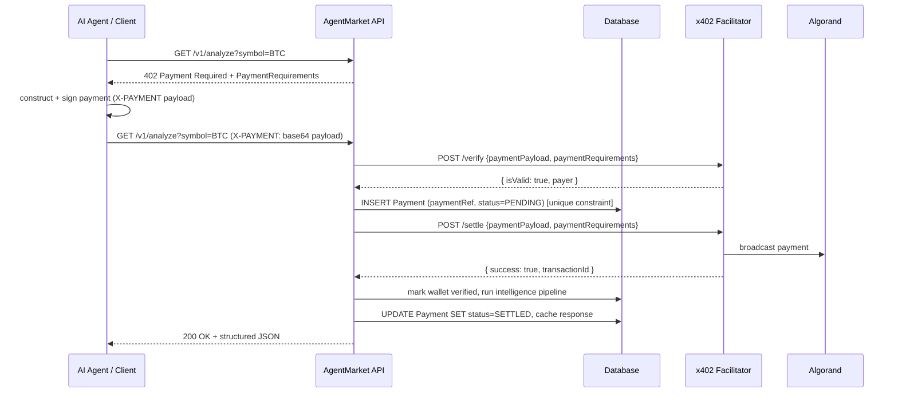

# Payment Flow (x402 on Algorand)

## Sequence



## Two payment provider modes

### `PAYMENT_PROVIDER=mock` (default)
An in-process `MockPaymentProvider` always verifies/settles successfully. This lets the
entire 402 → pay → 200 flow — including the frontend API Explorer — run with zero
TestNet funds or network access, which is what `npm run dev` uses out of the box. The
demo client (`apps/web/src/lib/x402-client.ts`) builds a payload carrying just the
connected wallet's address and a fresh nonce, since that is all `MockPaymentProvider`
inspects.

### `PAYMENT_PROVIDER=algorand-x402` (production)
`AlgorandX402Provider` calls a real x402 facilitator's `/verify` and `/settle` HTTP
endpoints against Algorand TestNet (or MainNet). In this mode the client must submit an
actual signed Algorand payment transaction per the x402 `exact` scheme, built with the
`@x402-avm/avm` client SDK (`ExactAvmScheme`). The API Explorer does this for real now
(`apps/web/src/lib/x402-client.ts`'s `buildRealPaymentHeader`, used whenever the 402
response's `network` isn't `"mock"`) — signing is routed through the connected Pera
Wallet session via `apps/web/src/lib/pera-signer.ts`'s `peraToClientAvmSigner`, which
adapts `PeraWalletConnect.signTransaction` into the `ClientAvmSigner` interface
`ExactAvmScheme` expects. `scripts/testnet/demo-payment.mjs` remains a useful
Node-only reference for the same envelope-wrapping (raw-key signer, no wallet UI). The
backend side (`AlgorandX402Provider`, the payment middleware, the idempotency/settlement
logic) needs no further changes to go from mock to real payments — only environment
variables:

```bash
PAYMENT_PROVIDER=algorand-x402
ALGORAND_NETWORK=testnet
X402_FACILITATOR_URL=https://facilitator.goplausible.xyz
X402_PAY_TO_ADDRESS=<your Algorand TestNet address>
X402_USDC_ASSET_ID=<USDC-on-Algorand-TestNet asset id>
X402_FEE_PAYER_ADDRESS=<facilitator's fee-payer address for this network>
```

**Important — this facilitator only speaks x402 v2 for Algorand.** Its `/supported`
discovery endpoint lists x402 v1 (legacy `algorand-testnet`/`algorand-mainnet` network
names) entries, but as of this writing those aren't actually wired up server-side —
a v1-shaped request gets `"No facilitator registered for scheme/network"` at `/verify`.
Confirmed empirically only x402 v2 works: CAIP-2 network id (`algorand:<genesis-hash>`),
a `payTo`/`amount`/`extra.feePayer`-driven **atomic transaction group** (the client's ASA
transfer plus a zero-amount fee-sponsor txn from the facilitator's `feePayer` account, so
the payer never needs ALGO for network fees), rather than v1's single signed transaction.
`AlgorandX402Provider.x402Version` is `2` for exactly this reason, and
`PaymentRequirement` carries both `maxAmountRequired` (used internally for spend-cap
math/DB bookkeeping) and `amount` (what the v2 AVM client scheme actually reads) with the
same value.

## Idempotency & replay protection

`paymentRef` has a **unique constraint** in the `Payment` table. For the AVM "exact"
scheme it's a sha256 fingerprint of the specific signed transaction inside the atomic
group's `paymentGroup` (deterministic — resubmitting the same signed payment yields the
same ref); other schemes fall back to the payload's `txId`/`nonce`/`signature`. The
payment middleware:

1. Looks up a `CachedResponse` keyed by `payment:<paymentRef>` first. If found, the
   stored response is replayed verbatim — no re-verification, no re-settlement, no
   re-execution of the intelligence pipeline.
2. Otherwise it attempts `INSERT Payment (paymentRef, status=PENDING)`. If that insert
   violates the unique constraint (a concurrent request already claimed this
   `paymentRef`), it returns `409 PAYMENT_ALREADY_SETTLED` rather than settling twice.
3. Only the request that won the insert proceeds to call the facilitator's `/settle`.

This is what makes duplicate payments, replayed `X-PAYMENT` headers, and concurrent
duplicate requests all safe by construction rather than by best-effort checking.

## Known gap: real wallet signing is untested against a live Pera session

`peraToClientAvmSigner` is written correctly against Pera's and `@x402-avm/avm`'s
documented type contracts (verified: typecheck, lint, `next build` all pass; the
`X-Wallet-Token` issue/verify/rate-limit-promotion round trip it depends on is verified
against a running server), but the actual signing call —
`PeraWalletConnect.signTransaction([group], address)` returning signed bytes for a
2-transaction atomic group where one leg is deliberately skipped (`signers: []`) — has
not been exercised against a real Pera mobile app or browser extension in this
environment (no way to complete an actual wallet-approval prompt here). The adapter
handles both plausible behaviors for how skipped legs come back (position-preserving
`null`s vs. an omit-and-shift array — see the comment in `pera-signer.ts`), but that's
a defensive hedge against documented ambiguity, not a substitute for testing it once
against a real funded TestNet wallet before this goes to production.

## Budget limits

Before settling, the middleware sums the wallet's settled spend since UTC midnight and
rejects (`402 BUDGET_EXCEEDED`) if the new payment would exceed `DAILY_SPEND_CAP_USD`
(default $50, configurable). This bounds worst-case damage from a runaway or compromised
agent.
