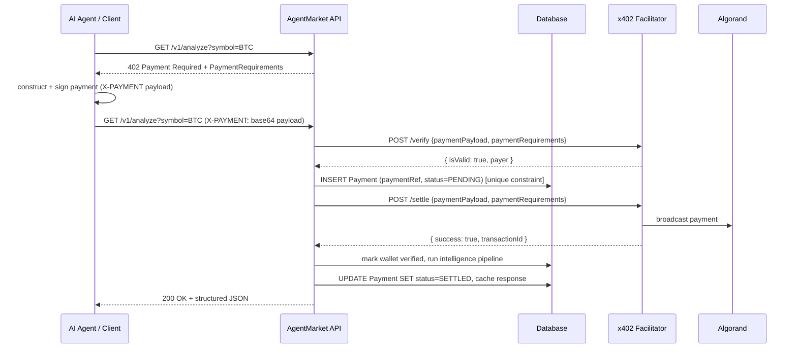

# Payment Flow (x402 on Algorand)

## Sequence



## Two payment provider modes

### `PAYMENT_PROVIDER=mock` (default)
An in-process `MockPaymentProvider` always verifies/settles successfully. This lets the
entire 402 → pay → 200 flow — including the frontend API Explorer — run with zero
TestNet funds or network access, which is what `npm run dev` uses out of the box. The
demo client (`apps/web/src/lib/x402-client.ts`) builds a payload carrying just the
connected wallet's address and a fresh nonce, since that is all `MockPaymentProvider`
inspects.

### `PAYMENT_PROVIDER=algorand-x402` (production)
`AlgorandX402Provider` calls a real x402 facilitator's `/verify` and `/settle` HTTP
endpoints against Algorand TestNet (or MainNet). In this mode the client must submit an
actual signed Algorand payment transaction per the x402 `exact` scheme, built with the
`@x402-avm/avm` client SDK (`ExactAvmScheme`). The API Explorer does this for real now
(`apps/web/src/lib/x402-client.ts`'s `buildRealPaymentHeader`, used whenever the 402
response's `network` isn't `"mock"`) — signing is routed through the connected Pera
Wallet session via `apps/web/src/lib/pera-signer.ts`'s `peraToClientAvmSigner`, which
adapts `PeraWalletConnect.signTransaction` into the `ClientAvmSigner` interface
`ExactAvmScheme` expects. `scripts/testnet/demo-payment.mjs` remains a useful
Node-only reference for the same envelope-wrapping (raw-key signer, no wallet UI). The
backend side (`AlgorandX402Provider`, the payment middleware, the idempotency/settlement
logic) needs no further changes to go from mock to real payments — only environment
variables:

```bash
PAYMENT_PROVIDER=algorand-x402
ALGORAND_NETWORK=testnet
X402_FACILITATOR_URL=https://facilitator.goplausible.xyz
X402_PAY_TO_ADDRESS=<your Algorand TestNet address>
X402_USDC_ASSET_ID=<USDC-on-Algorand-TestNet asset id>
X402_FEE_PAYER_ADDRESS=<facilitator's fee-payer address for this network>
```

**Important — this facilitator only speaks x402 v2 for Algorand.** Its `/supported`
discovery endpoint lists x402 v1 (legacy `algorand-testnet`/`algorand-mainnet` network
names) entries, but as of this writing those aren't actually wired up server-side —
a v1-shaped request gets `"No facilitator registered for scheme/network"` at `/verify`.
Confirmed empirically only x402 v2 works: CAIP-2 network id (`algorand:<genesis-hash>`),
a `payTo`/`amount`/`extra.feePayer`-driven **atomic transaction group** (the client's ASA
transfer plus a zero-amount fee-sponsor txn from the facilitator's `feePayer` account, so
the payer never needs ALGO for network fees), rather than v1's single signed transaction.
`AlgorandX402Provider.x402Version` is `2` for exactly this reason, and
`PaymentRequirement` carries both `maxAmountRequired` (used internally for spend-cap
math/DB bookkeeping) and `amount` (what the v2 AVM client scheme actually reads) with the
same value.

## Bazaar discovery & the Global x402 Challenge tag

Setting `X402_BAZAAR_DISCOVERY=true` makes `AlgorandX402Provider` attach a V1 discovery
descriptor (`PaymentRequirement.outputSchema`) to every requirement and a v2
`extensions.bazaar` (+ optional `extensions["x402-merchant"]`) block to the 402 response
body, so the GoPlausible facilitator can catalog the endpoint in its public Bazaar
(`GET /discovery/resources`) and, with `X402_CHALLENGE_TAG=x402-global-challenge` set too,
attribute settlements to the Global x402 Challenge leaderboard.

**A real MainNet settlement on 2026-09-11 exposed two compounding bugs in this**: the
payment went through correctly every time (200 OK, funds moved on-chain, a real
facilitator receipt was issued), but the resulting leaderboard entry kept showing
`bazaar: false, challenge: false` across many real settlements — the endpoint never
appeared in the Bazaar catalog at all. Root cause, confirmed against the live
facilitator's own `/discovery/resources`, `/data/leaderboards`, and `/api/receipt/{txId}`
endpoints, cross-checked against the canonical spec (`coinbase/x402` repo,
`specs/x402-specification-v2.md`) and GoPlausible's own client-library reference doc
(`x402-avm-extensions-examples.md`) — not guessed:

1. **Cataloging is a side effect of the *client* echoing the 402's `extensions` bag back**
   in its `X-PAYMENT` payload, per the x402 Bazaar extension's documented flow
   ("resource server declares → 402 carries `extensions.bazaar` → client copies it into
   `PaymentPayload` → facilitator extracts it at verify/settle"). None of this repo's three
   AVM payment clients did that — each built its outgoing `PaymentPayload` from only the
   single accepted `PaymentRequirement`, never the full 402 body.
2. Even a client that *did* echo it back would have lost it anyway: `PaymentPayloadSchema`
   had no `extensions` field, so `decodePaymentHeader`'s `.parse()` silently stripped it
   (zod drops unknown keys by default) before `AlgorandX402Provider.verify()`/`settle()`
   ever saw it.
3. **The real blocker, found only after fixing 1-2 and still seeing `bazaar:false` on
   settlements proven (via temporary instrumentation) to be sending `extensions`
   correctly**: the canonical x402 v2 spec puts the resource's real, absolute URL in a
   *top-level* `resource: { url, description, mimeType }` object on **both** the 402 body
   and the `PaymentPayload` — a field this codebase's `PaymentRequiredResponseSchema`/
   `PaymentPayloadSchema` never had at all. `PaymentRequirement.resource` (the field this
   codebase already had, on every `accepts[]` entry) is a completely different,
   AgentMarket-internal field: a relative route path (`/v1/analyze`) used for DB
   bookkeeping/audit labels, never an absolute URL, and per the spec doesn't belong on
   `PaymentRequirements` at all. The facilitator's Bazaar extractor keys its catalog entry
   on the *spec's* `resource.url` — which this codebase simply never sent — so cataloging
   silently no-op'd regardless of `extensions` being present and valid.

**Fix**: added the spec's `ResourceInfoSchema` (`{url, description?, mimeType?}`) to
`shared-types/payment.ts`, as an optional `resource` field on both
`PaymentRequiredResponseSchema` and `PaymentPayloadSchema`. `X402PaymentService.
buildPaymentRequired()` now takes an `origin` in its route context (the API's own
`originOf(request)` helper, wired in `middleware/x402-payment.ts`) and populates
`body.resource = { url: `${origin}${resource}`, ... }` — generically, for every payment
provider, not per-provider code. `PaymentScheme.createPayload()`'s third argument became
a `DiscoveryEcho` bag (`{extensions, resource}` from the 402 response) instead of just
`extensions`; every implementation (`AlgorandPaymentScheme`, the web app's
`buildRealPaymentHeader`/`buildRealAlgoPaymentHeader`, `demo-payment.mjs`) echoes both
fields verbatim into the payload it returns. `verify()`/`settle()` needed no change —
they already forward the whole decoded payload object. Regression tests:
`packages/payments/src/x402-header-codec.test.ts` (round-trip preserves `extensions` and
`resource`) and `packages/payments/src/algorand-x402-provider.test.ts` (`verify`/`settle`
forward `extensions` in the request body).

If you're debugging a similar "settled but not listed" symptom against this same
facilitator, check in order: (1) does the 402 body carry a top-level `resource: {url}`
with a real, absolute, publicly-reachable URL (not `localhost` — the facilitator can't
catalog an address it can't itself resolve) — this is the field that actually matters;
(2) does the 402 body also carry `extensions.bazaar` (`bazaarDiscovery` config on); (3)
does your client's outgoing X-PAYMENT payload contain both `resource` and `extensions`
keys, verbatim; (4) does your server's payload schema/decoder preserve those fields
rather than silently stripping unknown keys.

## Idempotency & replay protection

`paymentRef` has a **unique constraint** in the `Payment` table. For the AVM "exact"
scheme it's a sha256 fingerprint of the specific signed transaction inside the atomic
group's `paymentGroup` (deterministic — resubmitting the same signed payment yields the
same ref); other schemes fall back to the payload's `txId`/`nonce`/`signature`. The
payment middleware:

1. Looks up a `CachedResponse` keyed by `payment:<paymentRef>` first. If found, the
   stored response is replayed verbatim — no re-verification, no re-settlement, no
   re-execution of the intelligence pipeline.
2. Otherwise it attempts `INSERT Payment (paymentRef, status=PENDING)`. If that insert
   violates the unique constraint (a concurrent request already claimed this
   `paymentRef`), it returns `409 PAYMENT_ALREADY_SETTLED` rather than settling twice.
3. Only the request that won the insert proceeds to call the facilitator's `/settle`.

This is what makes duplicate payments, replayed `X-PAYMENT` headers, and concurrent
duplicate requests all safe by construction rather than by best-effort checking.

## Known gap: real wallet signing is untested against a live Pera session

`peraToClientAvmSigner` is written correctly against Pera's and `@x402-avm/avm`'s
documented type contracts (verified: typecheck, lint, `next build` all pass; the
`X-Wallet-Token` issue/verify/rate-limit-promotion round trip it depends on is verified
against a running server), but the actual signing call —
`PeraWalletConnect.signTransaction([group], address)` returning signed bytes for a
2-transaction atomic group where one leg is deliberately skipped (`signers: []`) — has
not been exercised against a real Pera mobile app or browser extension in this
environment (no way to complete an actual wallet-approval prompt here). The adapter
handles both plausible behaviors for how skipped legs come back (position-preserving
`null`s vs. an omit-and-shift array — see the comment in `pera-signer.ts`), but that's
a defensive hedge against documented ambiguity, not a substitute for testing it once
against a real funded TestNet wallet before this goes to production.

## Budget limits

Before settling, the middleware sums the wallet's settled spend since UTC midnight and
rejects (`402 BUDGET_EXCEEDED`) if the new payment would exceed `DAILY_SPEND_CAP_USD`
(default $50, configurable). This bounds worst-case damage from a runaway or compromised
agent.
